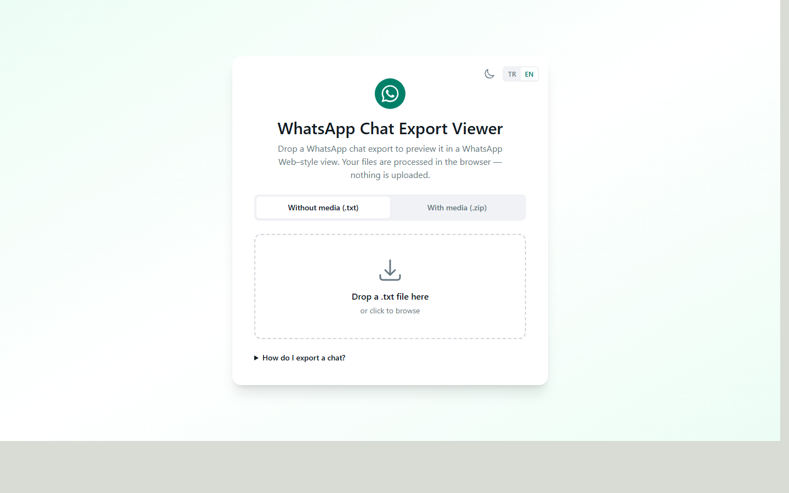
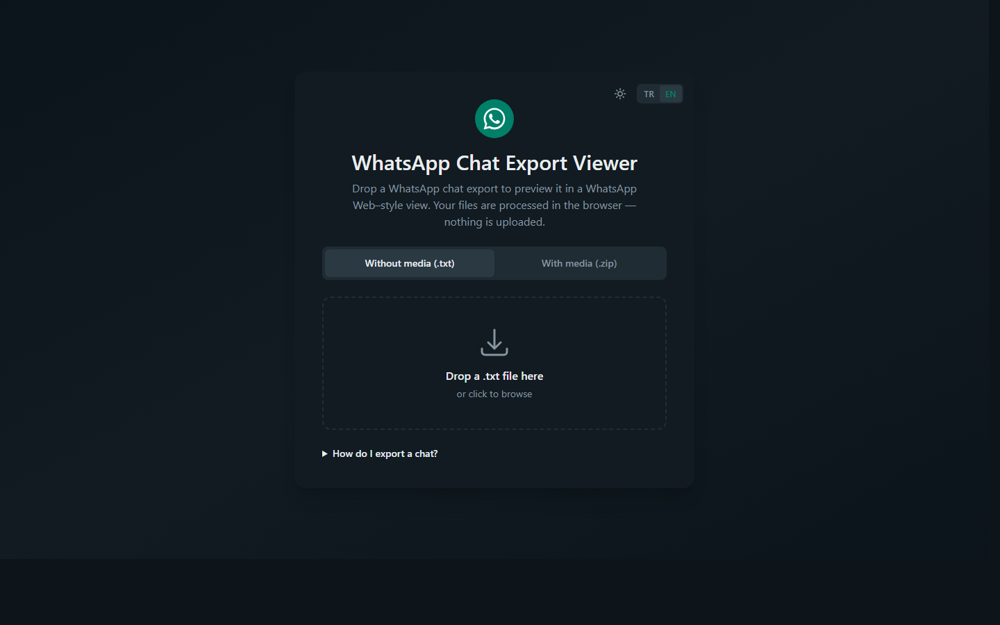

# WhatsApp Chat Export Viewer

> Preview WhatsApp chat exports (`.txt` and `.zip`) directly in your browser — rendered in a WhatsApp Web–style interface, with media attachments, light/dark mode, and English/Turkish UI. **Nothing is uploaded; everything runs client-side.**

A privacy-first viewer that reads the chat history WhatsApp gives you when you tap **Export chat** on your phone, and displays it the way you remember it from WhatsApp Web — bubbles, dates, avatars, the doodle wallpaper, the lot. Works with both the *Without Media* (`.txt`) and *Include Media* (`.zip`) export options.

> Türkçe: `.txt` veya `.zip` formatında dışa aktardığın WhatsApp sohbetini tarayıcıya bırak — WhatsApp Web görünümünde önizleme yapsın. Dosyalar yüklenmez, hepsi tarayıcında işlenir.

---

## Table of contents

- [Features](#features)
- [Screenshots](#screenshots)
- [Quick start](#quick-start)
- [How it works](#how-it-works)
- [Supported export formats](#supported-export-formats)
- [Tech stack](#tech-stack)
- [Project structure](#project-structure)
- [Configuration](#configuration)
- [Privacy](#privacy)
- [Roadmap](#roadmap)
- [Contributing](#contributing)
- [License](#license)
- [Acknowledgments](#acknowledgments)

---

## Features

- **Drag-and-drop import** — drop a `.txt` (without media) or `.zip` (with media) export onto the page.
- **WhatsApp Web–style UI** — sidebar, chat panel, message bubbles with tails, date separators, read ticks, the official doodle wallpaper.
- **Media rendering** — photos, videos, voice notes, stickers (`.webp`), GIFs, and document attachments inflated from the ZIP and shown inline.
- **Click-to-zoom lightbox** — images, videos, and stickers open in an in-page modal (no new tab); navigate between media with `←` / `→`, close with `Esc`.
- **Light & dark mode** — full WhatsApp Web color palette, with the official chat wallpaper rendered in both light and dark variants.
- **Multilingual UI** — English and Turkish, with locale-aware date separators (Today / Bugün, Yesterday / Dün, weekday names).
- **Smart "me" detection** — the most active participant is highlighted as outgoing (green bubbles) by default; switch it from the sidebar.
- **Group chat support** — sender names and color-tagged identities for group exports.
- **Auto-linkified URLs**, multi-line messages, system messages (encryption notice, joins/leaves), date pills with Today / Yesterday / weekday formatting.
- **Persistent preferences** — language and theme choices saved to `localStorage`.
- **Responsive layout** — full-width sidebar + chat on desktop, single-pane chat with a hamburger menu on mobile.
- **Pure client-side** — your chat never leaves the browser; the app has no backend.

## Screenshots

| Light | Dark |
| :---: | :---: |
|  |  |

> Deployment URL goes here. Until you ship it, run the dev server locally and open `http://localhost:3000`.

## Quick start

Requirements: **Node.js 18.17+** (Node 20+ recommended) and **npm**.

```bash
git clone https://github.com/<your-username>/whatsapp-chat-export-viewer.git
cd whatsapp-chat-export-viewer
npm install
npm run dev
```

Open <http://localhost:3000> and drop in a WhatsApp export.

> Don't have an export handy? Drop [`docs/sample-chat.txt`](docs/sample-chat.txt) onto the **Without media (.txt)** tab to see the viewer in action.

### Production build

```bash
npm run build
npm run start
```

The build is fully static — every page is prerendered. You can also deploy the output to any static host (Vercel, Netlify, GitHub Pages with a static export, Cloudflare Pages, etc.).

### How to export a chat from WhatsApp

1. Open the chat in WhatsApp on your phone.
2. Tap the chat name (or the three-dot menu) → **More** → **Export chat**.
3. Choose **Without Media** (produces a `.txt`) or **Include Media** (produces a `.zip`).
4. Send the file to yourself (email, AirDrop, cloud) and drop it onto this viewer.

## How it works

```
┌─────────────────┐    ┌────────────────────┐    ┌─────────────────────┐
│  File dropped   │ →  │  Parsed in-memory  │ →  │  Rendered as chat   │
│  (.txt / .zip)  │    │  (no network I/O)  │    │  (React + Tailwind) │
└─────────────────┘    └────────────────────┘    └─────────────────────┘
```

- For `.txt`: the file is read with `FileReader`, then `lib/parseWhatsApp.ts` walks each line, detects timestamps (iOS bracketed and Android dash-separated formats), splits sender/message, and stitches multi-line messages back together.
- For `.zip`: [JSZip](https://stuk.github.io/jszip/) opens the archive in memory, the chat `.txt` is located inside, and every media file becomes a `Blob` → `URL.createObjectURL(...)`. Filenames mentioned in attachment markers are matched to those blob URLs (case-insensitive, with basename fallback) and rendered inline as ``, `<video>`, `<audio>`, sticker, or document download link.

All object URLs are revoked when you load a different chat, so memory doesn't leak.

## Supported export formats

WhatsApp's export format is locale- and platform-dependent. This parser recognises the common variants:

| Platform | Example header line |
|---|---|
| iOS (most locales) | `[12.05.2025 14:23:45] Ayşe: Selam` |
| iOS (US/EN) | `[5/12/25, 2:23:45 PM] John: Hi` |
| Android (TR) | `12.05.2025 14:23 - Ayşe: Selam` |
| Android (EN) | `5/12/25, 14:23 - John: Hi` |

Attachment markers detected:

| Marker | Source |
|---|---|
| `<attached: filename.jpg>` | iOS (English) |
| `<filename.jpg eklendi>` | iOS (Turkish) — verb after filename |
| `<filename.jpg adjuntado>` / `joint` / `angehängt` / etc. | iOS (ES / FR / DE / IT / JA / KO / RU) |
| `filename.jpg (file attached)` | Android (English) |
| `filename.jpg (dosya eklendi)` | Android (Turkish) |
| `<Media omitted>` / `<Medya dahil edilmedi>` / `image omitted` | Text-only exports (placeholder shown) |

Bidi/RTL formatting marks WhatsApp sprinkles into export lines (LRM, RLM, FSI, PDI, etc.) are stripped before regex matching.

## Tech stack

- **[Next.js 14](https://nextjs.org/)** App Router (React 18, TypeScript)
- **[Tailwind CSS 3](https://tailwindcss.com/)** with CSS-variable color tokens for theming
- **[JSZip](https://stuk.github.io/jszip/)** for in-browser `.zip` parsing
- No backend, no analytics, no telemetry

## Project structure

```
.
├── app/
│   ├── icon.svg            # auto-detected favicon (WhatsApp app icon)
│   ├── layout.tsx          # root layout: theme init script, providers
│   ├── page.tsx            # client page: holds chat state, swaps Dropzone ↔ ChatView
│   └── globals.css         # Tailwind base + light/dark CSS variables
├── components/
│   ├── Avatar.tsx          # initials avatar with color hashed from name
│   ├── ChatView.tsx        # WA Web layout: sidebar + chat panel + lightbox host
│   ├── Dropzone.tsx        # landing screen with TXT/ZIP tabs + drag-drop
│   ├── I18nProvider.tsx    # locale context + dictionary lookup
│   ├── LanguageSwitcher.tsx
│   ├── Lightbox.tsx        # in-page image/video viewer with keyboard nav
│   ├── MessageBubble.tsx   # single message: bubble, attachment, timestamp
│   ├── ThemeProvider.tsx   # light/dark + FOUC-safe init script
│   └── ThemeSwitcher.tsx
├── lib/
│   ├── format.ts           # date/time/avatar helpers
│   ├── i18n.ts             # TR + EN dictionaries
│   ├── loadChat.ts         # file → parsed chat (txt or zip)
│   ├── parseWhatsApp.ts    # the regex parser
│   └── types.ts            # Message / ParsedChat / Attachment types
├── public/
│   ├── wa-chat-bg.svg      # WhatsApp Web doodle wallpaper (light)
│   └── wa-chat-bg-dark.svg # same pattern, baked for dark mode
└── tailwind.config.ts
```

## Configuration

| Setting | Where | Default |
|---|---|---|
| Default UI language | `components/I18nProvider.tsx` (`useState<Locale>(...)`) | `en` |
| Default theme | `components/ThemeProvider.tsx` | `light` |
| `localStorage` keys | `wa-preview-locale`, `wa-preview-theme` | — |
| WA chat background | `public/wa-chat-bg.svg`, `public/wa-chat-bg-dark.svg` | WhatsApp Web doodle |

To clear your saved preferences: open DevTools → Application → Local Storage → delete `wa-preview-locale` and `wa-preview-theme`.

## Privacy

This is the whole privacy story: **your chat export never leaves your browser tab.**

- No backend, no API routes, no server-side parsing.
- `FileReader` + `JSZip` operate entirely in-memory.
- Media files become `blob:` URLs scoped to the current document.
- Blob URLs are revoked when you load a different file or close the tab.
- No analytics, no third-party scripts, no cookies set by the app.

You can verify this by running the app offline (DevTools → Network → "Offline") after the initial page load — everything keeps working.

## Roadmap

Ideas for future versions; PRs welcome.

- Search within the loaded chat.
- Export the rendered view to PDF / a self-contained HTML file.
- Render reply quotations (current exports include the quoted text inline; structured display would be nicer).
- Voice note waveform + duration display.
- Reaction parsing for newer export formats that include them.
- More UI languages (the parser already handles most locales).

## Contributing

Contributions are very welcome. The codebase is small and approachable:

1. Fork → create a branch → make your change.
2. `npm run build` should pass (TypeScript + Next.js production build).
3. Open a pull request describing what changed and why.

If you have a WhatsApp export in a locale the parser doesn't recognise, please open an issue with one or two anonymised lines (the header + an attachment line is usually enough) — I'll add the variant.

## License

[MIT](LICENSE) — do whatever you want, just keep the notice.

## Acknowledgments

- The chat background pattern is WhatsApp's official asset from `static.whatsapp.net`. WhatsApp is a trademark of Meta Platforms, Inc. This project is an unaffiliated, non-commercial viewer for personal chat exports and is not endorsed by WhatsApp or Meta.
- [JSZip](https://stuk.github.io/jszip/) for the in-browser ZIP reader.
- [Tailwind CSS](https://tailwindcss.com/) and [Next.js](https://nextjs.org/) for the foundation.

---

**Keywords:** WhatsApp chat export viewer, WhatsApp Web preview, WhatsApp `.txt` parser, WhatsApp `.zip` import, view WhatsApp chat history in browser, WhatsApp export reader, Next.js WhatsApp viewer, WhatsApp Sohbet Görüntüleyici, WhatsApp dışa aktarım önizleme.
